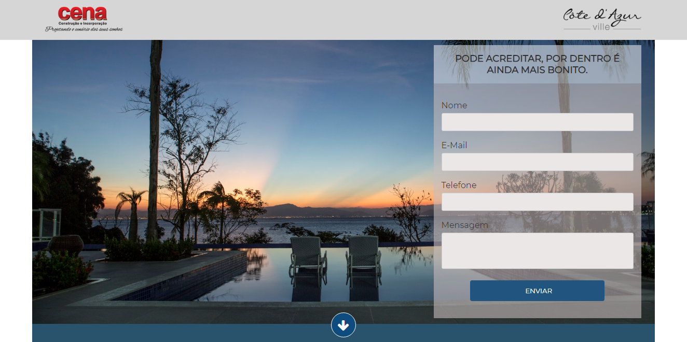
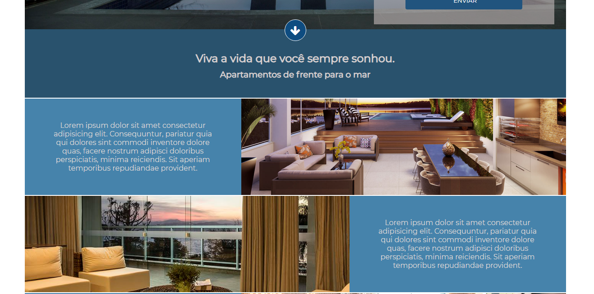

# Projeto - 01
> Landing Page - Use a vontade.
> Versão: 0.2

[![NPM Version][npm-image]][npm-url]
[![Build Status][travis-image]][travis-url]
[![Downloads Stats][npm-downloads]][npm-url]

Landing Page para conversão de leads de um determinado produto, esta landing page é um mero exemplo e pode ser modificada.





## Arquivos

* CSS -> *css/style.css*, arquivo contendo a estilização do site.

```
* {
    margin: 0;
    padding: 0;
    box-sizing: border-box;
    font-family: 'Montserrat', sans-serif;
}

html,
body {
    height: 100%;
}

a {
    text-decoration: none;

}

.center {
    width: 100%;
    max-width: 1200px;
    margin: 0 auto;
    padding: 0 2%;
}

.clear {
    clear: both;
}

/* -------------------------------------------
   Estilização do header
*/
header {
    width: 100%;
    padding: 5px;
    background-color: #D6D6D6;
    padding: 10px 2%;


}
```

* config.php -> *config.php*, arquivo que contém todas as configurações do site.
** Foi implantado neste arquivo a função para carregar todas as classes de forma automática.

```
 $autoload = function($classe){
     if($classe == 'Email'){
         include_once('classes/phpmailer/PHPMailerAutoload.php');
     }
     include('classes/'.$classe.'.php');
 }; //Final da variavel autoload
 spl_autoload_register($autoload);
```

* Email.php -> *classes/Email.php*, classe que envia o e-mail.
**Obs: Alterar os campos necessarios indicados no arquivo

```
/**
 * Classe que controla o envio de e-mails 
 * Autor: Bruno Salmito
 * Versão 1.0
 */

	class Email
	{

		private $mailer;

		public function __construct($host,$username,$password,$name){
						
			$this->mailer = new PHPMailer;

			$this->mailer->isSMTP();                                      	// Set mailer to use SMTP
			$this->mailer->Host = $host;  				  					// Specify main and backup SMTP servers
			$this->mailer->SMTPAuth = true;                               	// Enable SMTP authentication
			$this->mailer->Username = $username;       						// SMTP username
			$this->mailer->Password = $password;                       		// SMTP password
			$this->mailer->SMTPSecure = 'ssl';                            	// Enable TLS encryption, `ssl` also accepted
			$this->mailer->Port = 465;                                    	// TCP port to connect to

			$this->mailer->setFrom($username,$name);
			
			$this->mailer->isHTML(true);                                  	// Set email format to HTML
			
			$this->mailer->CharSet = 'UTF-8';

		}//fim do método construct


		public function setEmail($email,$name){
			/* Função para adicionar o endereço de e-mail */
			$this->mailer->addAddress($email,$name);
		}


		public function formatEmail($info){
			/* Função que vai formatar o e-mail a ser enviado */
			$this->mailer->Subject = $info['assunto'];
			$this->mailer->Body    = $info['corpo'];
			$this->mailer->AltBody = strip_tags($info['corpo']);
		}


		public function sendEmail(){
			/* Função que irá enviar o e-mail aos destinatários */
			if($this->mailer->send()){
				//Enviado com sucesso
				return true;
			}else{
				//Falha ao enviar
				return false;
			}
		}


	}//fim da classe
```
* Index -> *index.php*, para que o envio de e-mail funcione, você precisa adicionar neste arquivo as informações
da sua hospedagem, procure a linha abaixo no arquivo e modifique.

```
            $mail = new Email('HOST DA SUA HOSPEDAGEM',
            'USERNAME DA SUA HOSPEDAGEM',
            'SENHA DA SUA HOSPEDAGEM',
            'SEU NOME');

			$mail->setEmail('SEU E-MAIL DE DESTINO AQUI','Landing Page System');
```

* JS -> *js/script.js*, arquivo contendo os principais scripts JavaScript do site (Falta implantar)

```
script.js

```

## Próximas implatações

* Salvar dados do formulário no banco de dados.
* Implantar PHP Mailer (Funcionando).
* Implatar máscara no formulário.
* Painel administrativo com dashboard.
* Gal. de imagens.
* Real chat.


## Configuração para Desenvolvimento

Basta clonar ou fazer o download do repositório e mexer a vontade.


## Histórico de lançamentos
* 0.0.5 Adicionado ajax para controlar o envio de e-mails, os arquivos *js/formulario.js* e *ajax/formulario.php* foram adicionados. 
* 0.0.4
	* MUDANÇA: Adicionado novas funcionalidades no envio do e-mail.
	* Adicionado funções especificas na classe Email, agora basta ao instanciar o objeto
	passar os paramêtros de conexão.
* 0.0.3
    * MUDANÇA: Adicionado PHPMailer para envio do formulário para e-mail.
    * Fazer as alterações de host, usuário, porta e e-mail de destino na `classe/Email.php`;
* 0.0.2
    * MUDANÇA: Atualização do css (código do módulo permanece inalterado)
* 0.0.1
    * Trabalho em andamento

## Meta

Bruno Salmito – [@bruno.salmito.5](https://web.facebook.com/bruno.salmito.5) – brunosalmito@gmail.com

Distribuído sob a licença MIT. Veja `LICENSE` para mais informações.

[https://github.com/bruno-salmito/github-link](https://github.com/bruno-salmito/)

## Contributing

1. Faça o _fork_ do projeto (<https://github.com/bruno-salmito/LandingPage/fork>)
2. Crie uma _branch_ para sua modificação (`git checkout -b feature/fooBar`)
3. Faça o _commit_ (`git commit -am 'Add some fooBar'`)
4. _Push_ (`git push origin feature/fooBar`)
5. Crie um novo _Pull Request_

[npm-image]: https://img.shields.io/npm/v/datadog-metrics.svg?style=flat-square
[npm-url]: https://npmjs.org/package/datadog-metrics
[npm-downloads]: https://img.shields.io/npm/dm/datadog-metrics.svg?style=flat-square
[travis-image]: https://img.shields.io/travis/dbader/node-datadog-metrics/master.svg?style=flat-square
[travis-url]: https://travis-ci.org/dbader/node-datadog-metrics
[wiki]: https://github.com/bruno-salmito/LandingPage/wiki
